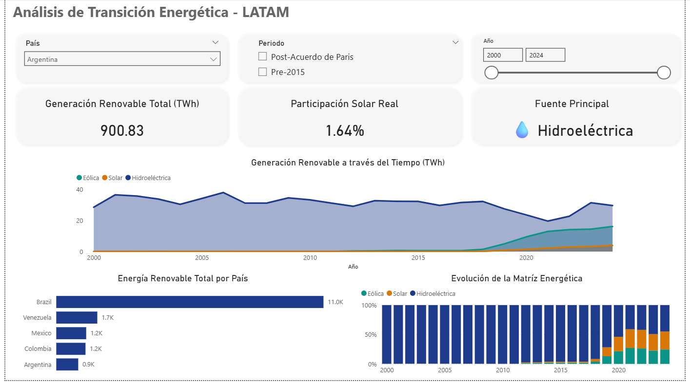

# ⚡ Análisis de Transición Energética en LATAM: Pipeline ETL & Visualización

## 📖 Sobre el Proyecto
Este proyecto consiste en el desarrollo de un **Pipeline de Datos (ETL) End-to-End** para analizar la evolución, capacidad y participación de las energías renovables en América Latina. 

El objetivo principal es construir una arquitectura de datos robusta y escalable que simule un entorno de producción real: desde la extracción automatizada de la información cruda, pasando por su almacenamiento en un contenedor, hasta la creación de un modelo semántico y visualización en Business Intelligence.

## 🛠️ Arquitectura y Stack Tecnológico
* **Python (Extracción y Transformación):** Scripts automatizados para la extracción y limpieza inicial de datos utilizando Pandas.
* **Docker & PostgreSQL (Almacenamiento):** Implementación de la base de datos relacional dentro de un contenedor Docker para un entorno local reproducible.
* **SQL (Ingesta):** Creación de esquemas y tablas para la gestión de los registros históricos de generación de energía.
* **Power BI & DAX (Visualización):** Conexión directa a PostgreSQL, creación de métricas de negocio con DAX y diseño de un dashboard interactivo optimizado.

## ⚙️ Optimización y Performance Tuning
Para asegurar un rendimiento óptimo al visualizar el alto volumen de datos históricos:
* Se reemplazaron gráficos de alto consumo por una **Matriz con Minigráficos (Sparklines)**, mejorando drásticamente el uso de memoria RAM del motor VertiPaq.
* Se aplicaron técnicas de *Query Reduction* (reducción de consultas) en Power BI para una experiencia de usuario fluida.

## 🚀 Cómo reproducir este proyecto
1. Clona este repositorio.
2. Ejecuta los scripts de **Python** en la carpeta `/scripts` para generar los datos iniciales.
3. Levanta la base de datos ejecutando: `docker-compose up -d`
4. Abre el archivo `.pbix` y actualiza las credenciales de origen de datos hacia tu `localhost`.
